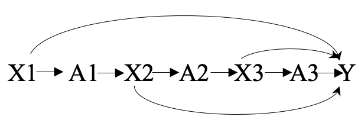

```{r setup, include=FALSE}
knitr::opts_chunk$set(echo = TRUE)
```

# Introduction
There is a debate about whether candidates are increasingly using negative advertising in recent years. Understandably, negative advertising is difficult to define. Whether to criticize or attack opponent messages or attack their race and gender, individuals are most likely to have a different perception of what makes advertising negative. Regardless, their existence is perceived by many as a threat to human decency, fairness, and ethical campaign.  

Candidates will use any media available to them to reach their potential audiences, including the internet. The involvement of Facebook and the infamous Cambridge Analytica in the 2016 US presidential election shocked our society, shifting our attention to new possibilities that we never knew we had. Facebook is a prominent market in political advertising. With 223.03 million users in the United States as for the first second of 2020 [@web1], Facebook attracts candidates to create their champaign and deliver a message. Emarketer [@web2] estimated that Facebook brings in $796.8 million revenue on political advertising in 2019/2020 election cycle in the United States. That translates to 59.4 percent of share on political advertising market.  

Additionally, we saw how Facebook and other social media infrastructure can now enable micro advertisements to its users. It enables candidates to tailor their advertising depending on an individual specific profile. This ability could potentially increase negative advertising in the years to come. 

This paper examines what motivates candidates to use negative advertising in the US 2020 Presidential election race between Trump and Biden. Using Skaperdas & Grofman's theory [-@Skaperdas95]on a two-candidate race, I test the hypothesis that the frontrunner will use more positive advertising while the opponent will use more negative advertising. This paper use a polling result to whether a campaign team are losing or leading. As an analysis, we use a dynamic causal inference framework to disentangle the polls' time-varying effects to negativity. 

# Literature Review
Political campaigning, where a candidate tries to win the election race over other candidates by the very nature, is competitive. Thus, it is common and reasonable for candidates to attack other candidates to win a race. However, it is not easy when it comes to deciding what is fair or not. Negative often perceive as something terrible and unfair, while positive is good. However, due to this very nature of competitiveness, this dichotomy is hard to define and loses its power when we try to apply it to the entire campaign [@Lau09].

Practically, it is voters who decide what is fair or not. One example of how voters perceive negativity in a political campaign is a perceived fairness index by Freedman et al.[-@Freedman99]. They measure negativity in a political advertisement on a scale (1-100)—this measurement specifies campaign messages that mention other candidate attributes, either personal or office related. Generally, attacking the opponent's voting record or inconsistencies, business practices, and campaign fund is a fair criticism. On the other hand, attacking their past personal troubles or family member behavior is off-limit. However, it is worth to mention that voters can be biased. Sides et al. (-@Sides03) find that voters do not necessarily perceive this negativity as they are. Voters tend to be biased in partisanship, displaying some double standard. They react more aggressively when their party's opponent is going negative[@Sides03].
 
Negativity can have a detrimental effect on the general political process. It may lead to more significant discrimination and greater polarization [@Garramone90]. It may also decrease the turnout rate on election day. Krupnikov [-@Yanna11] examined data from the US presidential campaign from 1976 to 2004 and found that negativity in a political campaign can indeed demobilize voters. This effect may occur when voters are exposed to a negative advertisement after firmly has a preferred candidate, and the negativity is about their preferred candidate. Peterson and Djupe [-@Djupe05] also find a similar demobilization effect on non-partisan voters. Additionally, voters who are most inclined to support negative campaigning are the least satisfied with campaigns[@Sides03].

Regardless of how people might respond to negativity in an advertisement, Vargo and Hopp [-@Vargo20] found that negative advertisements are intensely engaging. Based on political advertisements placed by the Russian-based Internet Research Agency on the two biggest online political platforms: Facebook and Instagram, they conclude that advertisement that expresses anger and fear such as using unnecessarily negative emotional language, any vulgar language, and expressing potential threat to the audience. Their analyses showed that audiences engage with the advertisements at rates that exceed industry benchmarks and that clickthrough rates increased closer to election day.

Political advertising in online media in some way is different from conventional media like TV or newspaper. There is no more profound example for online political advertising than the 2008 and 2012 Obama presidential campaign election. In 2008, the Obama campaign introduced online advertising designed to find and mobilize supporters while also persuade swing voters. In 2012, the campaign expanded its ability to target messages based on models of voters' behavior and attitudes by integrating online data and voter files [@Barnard15].

We can expect that online advertisements are an appealing medium to reach young voters compared to traditional media. Leppaniemi et al.[-@lappaniemi10] argue that online advertising can reach young voters and increase turnout rates. Online advertisements are also easier to publish and relatively low cost. This unmediated channel also helps parties and candidates to wage massive ground campaigns. Moreover, online advertising can be deployed more swiftly and reliable than local volunteers[@Dommett19].

Online advertising can also give candidates the ability to target voters more precisely than on television. The targeting gives them opportunities to craft their message to narrower audiences, thus improving voters' engagement. Political. Campaigns, however, often do not take of these opportunities yet as the resources it takes to craft and test messages is significant[@Jessica17].

Despite these differences, there is no evidence that candidates deliver different messages in online advertising and other traditional media. Anstead[-@Anstead18] uses Facebook API to examine Facebook's online advertising in the 2017 United Kingdom General Election and find that the advertisements deliver closely similar national campaign narratives. Additionally, online advertising does not appear to have a higher negative than other traditional campaign media[@Anstead18].

There are several theories on what motivates negative advertising in a political setting. Skaperdas & Grofman's theory[-@Skaperdas95] generates a model on negativity campaigning based on a few basic general assumptions. They suggest that the frontrunner will use more positive advertising in a two-candidate race, while the opponent will use more negative advertising. Meanwhile, a three-candidate race with one candidate trailing by a large margin will go only positive. Finally, in any three-candidate race, no candidate will engage in a negative campaign against the weaker of his/her two opponents. 

In contrast, Harrington er.al [-@Harr96] suggests that the likelihood of going negative depends on the candidate's attributes. They examine candidates' resources allocation between positive campaigning and negative campaigning under two assumption. Firstly, they assume that candidates have a initial locations and it is costly to relocate. Secondly, rivals' actions affects the relocation is affected. Under these two assumption, they conclude that the candidate who has less attractive personal attributes runs a relatively more negative campaign. Peterson and Djupe[-@Djupe05] also find other factors that affect negativity other than whether a candidate is trailing or not on a research newspaper coverage of every contested Senate primary in 1998. They find that negativity is affected by the timing of the race, the Senate seat's status, and the quantity and quality of the challengers in the primary. The more candidates in the race, the greater the need for a candidate to differentiate themselves by going negative. A candidate who is facing the incumbent also more likely to go negative. In terms of timing, negativity is most common at the beginning and end of campaigns as candidates try to establish themselves early and take over their opponents at the very last minute[@Djupe05]. 

Finally, it is important to note that a dynamic strategy is essential when analyzing causal inference in political science[@Black13]. The assumption made that candidates adjust their campaign strategy in response to their poll position (whether they are in a leading or trailing position) and opponents' actions (whether it is vital to retaliate to opponents' negative advertising or not). Thus, he argues that the single-shot research assumption is inappropriate in a political campaign setting. Backwell[-@Black13] presenting a holistic framework for dynamic causal inference to campaign US statewide elections (2000–2006) and found a result that negative advertising is an effective strategy for nonincumbents. This result is in contrast to the previous literature and alternative methods.

# Data and Methods
Based on the assumption that candidates are adjusting their campaign strategy in response to their poll position, we use a dynamic causal inference approach to examine online political advertisement by the Democratic and Republican Party on the United States 2020 Presidential election on Facebook. 

This paper uses advertisement data from Facebook and poll results by states. For exploratory analysis we will use training set (randomly selected 60 percent of dataset) to illustrate and explore the relationship between polling position and negativity. On confirmatory analysis we will use test set (dataset that were not selected as training). Test set will include a observation of proportion advertisement from candidate by party, by state and time period measured in week one to four.

Picture below summarise how we design our research. This paper divide a time frame for campaign into a four week. Where X1 is the proportion of negative advertisement at the begining of the campaign (baseline/week 1 outcome). A1, A2, and A3 is a polling position of candidate in a state at the end of week one, two and three respectively. X2 and X3 is intermediate result, that is the proportion of negative advertisement for week two and three. Finally, Y is the outcome, that is the proportion of negative advertisement for the last week. This paper assumed that what happen in A1 will affects X2, what happen in A2 will affects X3 and so on. 


This paper uses an inverse probability weighting to create a weighted outcome and intermediate outcome.
The estimator formula for IPWE is as follows:

$$\hat{\mu}_{a,n} IPWE = \frac{1}{n} \sum_{i=1}^{n} Y_i \frac{1_{A=a}}{\hat{p}_{n}(A_i=a|X_i;\alpha)}     (1)$$

Where Where Y_i is proportion of negative ads in week i, and n is the number of observation. X_i is covariates, and A is a possible position (trailing or not).

If estimated propensities are small, Inverse Probability Weighted Estimator (IPWE) can be unstable. Thus we also need to estimate stabilized weighted estimator. The formula is similar to estimator for IPSE above, but we use marginal probability of action, conditional on past action as numerator[@Black13].

$$\hat{\mu}_{a,n} IPWE = \frac{1}{n} \sum_{i=1}^{n} Y_i \frac{\hat{p}_{n}(A_i=a|X_i;\sigma)}{\hat{p}_{n}(A_i=a|X_i;\alpha)}    (2)$$

Finally, to measure a time-varying Effects of polls position to negativity this study performs weighted regressions that account for time-varying confounders via marginal structural models as follow:

$$E[Y_i(a)] = \beta_0 + \beta_1 \left(\sum_{T=1}^{4} A_{it}\right) (3) $$

Where Y is outcome and T is the number of observed outcome (4 week) and A is a polls position (losing or not).

Advertisement data were taken from Facebook Ads Library, selecting only political and issue advertisement that reached United States from September 27, 2020 to October 27, 2020. According to the Facebook Political Advertising policy, October 27 is the last day a candidate can post new advertisement and removing or changing the content of current active advertisements. Thus, this is the last day a candidate can respond to polling results. Any political advertisement on Facebook will be removed from Facebook a day before election day. 
```{r message=FALSE, eval=FALSE, echo=FALSE, results=FALSE}
## data importing
library(tidyverse)
library(httr)
########################### getting dataset using Facebook library
# define api link
my_link<- "https://graph.facebook.com/v8.0"
# insert token key
my_token <- "paste token key here" 
# define querry fields
querry_fields <- c("id",
                "ad_creation_time", 
                "ad_delivery_start_time", 
                "ad_delivery_stop_time",
                "ad_creative_body", 
                "page_id",
                "page_name",
                "currency",
                "spend",
                "demographic_distribution",
                "funding_entity",
                "impressions",
                "region_distribution",
                "potential_reach"
                ) %>% 
  str_c(., collapse=", ")

pgid <- c("153080620724", "7860876103") %>%
  str_c(., collapse=", ")

#get the data from the first 'page' of data the api provides
page_one_response <- GET(my_link,
                         path = "/ads_archive",
                         query = list(access_token = my_token,
                                      ad_delivery_date_max = "2020-10-27",
                                      ad_delivery_date_min = "2020-09-27",
                                      limit=100,
                                      ad_active_status="ALL",
                                      fields=querry_fields,
                                      ad_type="POLITICAL_AND_ISSUE_ADS",
                                      ad_reached_countries="US",
                                      search_page_ids = pgid)
                         )
page_one_content<- content(page_one_response)

x <- tibble(data=page_one_content$data)
df <- x %>% 
  unnest_wider(data)

### Get the next page, loop until all of pages is added to the main dataset
# get the link refering to the next page
next_link <- page_one_content$paging$`next`

#iterate over all pages until there is no further page
while(length(next_link)>0) {
  next_response <- GET(next_link)
  next_content<- content(next_response)
  
  y <- tibble(data=next_content$data)
  df_next <- y %>% 
    unnest_wider(data) 
  
  df <- bind_rows(df, df_next)  
  
  next_link <- next_content$paging$`next`
  
}
## save file, don't evaluate this chunk without preparing a significant time 
## to download datasets
save(df, file = "dfall.Rdata")
```

```{r message=FALSE, cache=TRUE, echo=FALSE}
## loading the saved data and tidy
library(tidyverse)
library(lubridate)
load("dfall.Rdata")
df <- df %>% 
  mutate(ad_delivery_start_time = parse_date(ad_delivery_start_time),
         ad_delivery_stop_time = parse_date(ad_delivery_stop_time)) %>%
  filter(!is.na(ad_creative_body))

df$ad_delivery_start_time[ month(df$ad_delivery_start_time) == 9 & day(df$ad_delivery_start_time)<27] <- "2020-09-27"
df$ad_delivery_stop_time[ is.na(df$ad_delivery_stop_time)] <- "2020-10-27"
df$ad_delivery_stop_time[ df$ad_delivery_stop_time >"2020-10-27"] <- "2020-10-27"


dateFrame <- vector(mode = "list", length = nrow(df))
start.date.vec <- sort(unique(df$ad_delivery_start_time))
for(i in seq_along(dateFrame)) {
  a <- df$id[i]
  day.length <- 1+ as.numeric(df$ad_delivery_stop_time[i] - df$ad_delivery_start_time[i])
  day.start <- which(start.date.vec == df$ad_delivery_start_time[i])
  day.end <- day.start + day.length -1 
  id.vec <- rep(a,day.length)
  daynum.vec <- day.start:day.end
  dateFrame[[i]] <- data.frame(id = id.vec ,
           days = daynum.vec)
}

dateFrame <- do.call(rbind, dateFrame)
````

The way that an entity can advertise on Facebook is to have a dedicated Facebook Page. Thus, to make sure we can identify the advertiser’s party identity, we take all published advertisements by Donald Trump Official Facebook Page and Joe Biden Official Facebook Page. That being said, it doesn’t mean that this paper only uses advertisements that appeared on those two Facebook Page. In fact, political advertisements that were appeared to Facebook users during the campaign are from these two Facebook Pages. Joe Biden Official Page published more than 95 percent of all Democrat’s Presidential Race advertisement while Donald J Trump Official Page comprises about 85 percent of all Republican’s Presidential Race advertisement.
```{r message=FALSE, cache=TRUE, echo=FALSE}
# detect words in advertisement body
df.content <- df %>%
  select(id, ad_creative_body, funding_entity) %>%
  mutate(trump_word = ifelse(str_detect(ad_creative_body, 
                      "Trump|trump|Pence|pence") == TRUE, 1, 0),
         biden_word = ifelse(str_detect(ad_creative_body, 
                      "Biden|biden|Harris|harris") == TRUE, 1, 0))%>%
  select(-ad_creative_body)

entity <- unique(df$funding_entity)
## manually label entity to neutral, Trump, or Biden, 
entity_label <- c("D1","D2","R1","R2")
df.entity <- data.frame(funding_entity = entity,
                        entity_label = entity_label)
df.content <- df.content %>%
  left_join(df.entity) %>%
  select(-funding_entity) %>%
  mutate( negative = ifelse(str_sub(entity_label,1,1) == "D" & trump_word == 0, 0, 1),
          negative = ifelse(str_sub(entity_label,1,1) == "R" & biden_word == 0, 0, negative))


dateFrame.content <- dateFrame %>%
  left_join(df.content)
rm(df.content)

set.seed(1234)
index <- sample(nrow(dateFrame.content), 0.6*nrow(dateFrame.content))
train <- dateFrame.content[index,]
test <- dateFrame.content[-index,]

## take region/state distribution of datasetet. 

df_geo <- df %>% 
  select(id, region_distribution) %>% 
  unnest_longer(region_distribution) %>% 
  unnest_wider(region_distribution)

df_geo.fullonly <- df_geo %>%
  mutate(percentage = parse_number(percentage)) %>%
  filter(percentage>0.95)

train <- train %>%
  left_join(df_geo.fullonly) %>%
  na.omit()
################### Using Test dataset ##############
## From now on, we will use test set to create data panel that can 
## handle IPWT function
dateFrame.state.content <- test %>%
  left_join(df_geo.fullonly)

dateFrame.state.content <- na.omit(dateFrame.state.content)
dateFrame.state.content <- dateFrame.state.content %>%
  select(-percentage)
```

This study separates the dataset into 4 parts (week) and calculates the proportion of negative advertisement by party and state. Week 1 is a baseline, week 2 and 3 is an intermediate result, and week 4 is an outcome.

The poll data are taken from FiveThirtyEight, comprises about 1,484 individual polling from 146 pollsters between 2020/09/27 to 2020/10/27. I take average polling results at the end of the week to determine whether an observation are leading or losing. We exclude the last day of week four because There is no time for candidate to respond a polls position. Finally, this paper only use data from competitive states, that is states where at no point during a campaign one candidate is leading by more than 30 percent in a polling result.

```{r message=FALSE, cache=TRUE, echo=FALSE, warning=FALSE, results=FALSE}
poll <- read_csv("polls/president_polls.csv")

count.poll <- poll%>%
  filter(cycle == 2020, 
         office_type ==  "U.S. President",
         candidate_party == "REP" | candidate_party == "DEM") %>%
  mutate(end_date = parse_date(end_date, "%m/%d/%y"),
         state = str_remove_all(state, " CD-.$")) %>%
  filter(end_date > "2020-09-26" & end_date < "2020-10-28") %>%
  select(poll_id) %>%
  distinct() %>%
  nrow()

count.pollster <- poll%>%
  filter(cycle == 2020, 
         office_type ==  "U.S. President",
         candidate_party == "REP" | candidate_party == "DEM") %>%
  mutate(end_date = parse_date(end_date, "%m/%d/%y"),
         state = str_remove_all(state, " CD-.$")) %>%
  filter(end_date > "2020-09-26" & end_date < "2020-10-28") %>%
  select(pollster) %>%
  distinct() %>%
  nrow()

pres.poll <- poll%>%
  filter(cycle == 2020, 
         office_type ==  "U.S. President",
         candidate_party == "REP" | candidate_party == "DEM") %>%
  select(state, end_date, candidate_party, pct) %>%
  mutate(end_date = parse_date(end_date, "%m/%d/%y"),
         state = str_remove_all(state, " CD-.$")) %>%
  na.omit() %>%
  filter(end_date > "2020-09-26" & end_date < "2020-10-28")

## check if all states have a polling until oct 27th
pres.poll %>%
  filter(end_date == "2020-10-27") %>%
  select(state) %>%
  distinct() %>%
  nrow() == 51

## take unique states name
states <- unique(pres.poll$state)

df.poll <-  vector(mode="list", length = length(states))

for (i in seq_along(df.poll)) {
  pres.poll.tidy <- pres.poll %>%
    filter(state == states[i]) %>%
    group_by(state, end_date,candidate_party) %>%
    summarise( pct = mean(pct)) %>%
    spread(candidate_party,pct)
  pres.poll.tidy$start_date <- pres.poll.tidy$end_date
  pres.poll.tidy$start_date[1] <- "2020-09-27" ## we make earlist poll available since sept 27th
  pres.poll.tidy$end_date <- c(pres.poll.tidy$end_date[-1]-1,"2020-10-27")
  per.state.list <- vector(mode="list", length = nrow(pres.poll.tidy))
  for (j in seq_along(per.state.list)) {
    day.length <- 1+ as.numeric(pres.poll.tidy$end_date[j] - pres.poll.tidy$start_date[j])
    day.start <- which(start.date.vec == pres.poll.tidy$start_date[j])
    day.end <- day.start + day.length -1 
    state <- rep(pres.poll.tidy$state[j],day.length)
    dem <- rep(pres.poll.tidy$DEM[j],day.length)
    rep <- rep(pres.poll.tidy$REP[j],day.length)
    daynum.vec <- day.start:day.end
    per.state.list[[j]] <- data.frame(state = state,
                                      dem = dem,
                                      rep = rep,
                                      days = daynum.vec)
    }
  df.poll[[i]] <- do.call(rbind, per.state.list)
}

df.poll <- do.call(rbind, df.poll)
## check if number is match for 31 days adn 51 states
nrow(df.poll) == 51*31

## change variable name
df.poll <- df.poll %>%
  rename(region = state)
## check for state that has a overtakaing polls
var.state <- df.poll%>%
  mutate( lead = ifelse(dem>rep,"D","R")) %>%
  group_by(region, lead) %>%
  tally() %>%
  filter(n != 31) %>%
  select(region) %>%
  unique()
var.state <- var.state$region
```

The graphs below is created with *training* data that were randomly selected from the dataset. The training set is 60 percent of the main dataset. The number of political advertising doesn’t follow a normal distribution. The frequency peaked at the early days at near the end of the time frame. Assuming that the presidential race begins near the first presidential debate (September 29, 2020), we can see the pattern that candidates use online political advertising at the beginning and end of the campaign. The distribution of negative advertisements by days also shows us a similar pattern, with many advertisements at the beginning and near the end of the period. This pattern is consistent with a study from Senate primary in 1998 that negativity is most common at the beginning and end of campaigns when candidates try to establish themselves early and to seal the election at the very last minute[@Djupe05]. There is also a difference in the distribution of negative ads by a party. Republicans have a higher number of negative advertising during a campaign than a democrat. 
```{r echo=FALSE, cache=TRUE, message=FALSE}
competitive.state <- df.poll %>%
  mutate(lead= dem-rep) %>%
  filter(abs(lead)<30) %>%
  select(region)

train <- train %>%
  semi_join(competitive.state)

plot1 <- train %>%
  ggplot(aes(days)) + geom_histogram(bins = 31) + theme_bw() + 
  ggtitle("Active # Ads distribution by days")

plot2 <- train %>%
  group_by(days) %>%
  summarise(neg.count = sum(negative)) %>%
  ggplot(aes(days, neg.count)) + geom_smooth(se= FALSE) + 
  theme_bw() + 
  ggtitle("Negative Ads distribution by days")


plot3 <- train %>%
  mutate(entity_label = str_sub(entity_label,1,1)) %>%
  group_by(entity_label, days) %>%
  summarise(negative = sum(negative)) %>%
  ggplot(aes(entity_label, negative)) + geom_boxplot() + theme_bw() + 
  labs(title = "Negative advertisement distribution by party")

library(gridExtra)
grid.arrange(plot1, plot2, plot3, ncol=2, nrow=2)
```

The graph below shows that republican has higher number of negative advertisement than democrat. At the same timeline, democrat are consistenly leading at average national polls. The graph also shows that democrat has a steady increase over the period while republican has a slight decrease. At the end of the campaign, democrat campaigner overtakes republican in terms of the number of active negative advertising.

However, democrat are actually has a higher proportion of negative advertising than republican. This is not necessarily rejects the argument that losing candidate will engage more in negative advertisement. This paper argue that at the start of the campaigning, democrat are inherently more negative than republican. However, as campaign goes on polls position favor a democrat, thus push republican to go more negative. We can see that as time goes by, the proportion of negative advertisemnt by democrat is decreasing while the opponent is increasing. This might illustrate that losing candidate engage in more negative advertising as respond to a polls position.
```{r message=FALSE, echo=FALSE, cache=TRUE}
plot4 <- train %>%
  mutate(entity_label = str_sub(entity_label,1,1)) %>%
  group_by(entity_label, days) %>%
  summarise(negative = sum(negative)) %>%
  ggplot(aes(days, negative, color = entity_label)) + geom_point() + geom_line() + 
  theme_bw() + 
  scale_linetype_manual(values = c("solid","dashed")) +
  scale_color_manual(values = c("blue","red")) +
  labs(title ="# Negative Ads Trends by party")

plot5 <- train %>%
  mutate(entity_label = str_sub(entity_label,1,1)) %>%
  group_by(entity_label, days) %>%
  summarise(negative = mean(negative)) %>%
  ggplot(aes(days, negative, color = entity_label)) + geom_point() + geom_line() + 
  theme_bw() + 
  scale_linetype_manual(values = c("solid","dashed")) +
  scale_color_manual(values = c("blue","red")) +
  labs(title ="Proportion of Negative Ads Trends by party")

plot6 <- df.poll %>%
  mutate(lead= dem-rep) %>%
  filter(abs(lead)<30) %>%
  gather(dem:rep, key = party, val= percent_polls) %>%
  ggplot(aes(days,percent_polls,color = party)) + geom_smooth(se=FALSE) +
  theme_bw() + 
  scale_linetype_manual(values = c("solid","dashed")) +
  scale_color_manual(values = c("blue","red")) +
  labs(title =" Polls Trends by party")

grid.arrange(plot4, plot5, plot6, ncol=2, nrow=2)
```

```{r message=FALSE, cache=TRUE, echo=FALSE, results=FALSE}
## combine ads and poll dataset
## check for any mismatch in state name
dateFrame.state.content %>%
  select(region) %>%
  semi_join(df.poll) %>%
  unique() %>%
  nrow() ## one states coded differently in tow dataframe, that is washington DC

## recode state that are mismatch
df.poll$region <- recode(df.poll$region, 'District of Columbia' = "Washington, District of Columbia")

df.poll.week <- df.poll %>%
  filter(days %in% c(6,15,24,31))

## mutate poll dataset into week term
df.poll.week <- df.poll.week  %>%
  mutate(week = ifelse(days <7,1,0),
         week = ifelse(days>=7 & days<16,2,week),
         week = ifelse(days>=16 & days<25,3,week),
         week = ifelse(days>=25,4,week)) %>%
  select(-days)

## mutate ads dataset into week term
dateFrame.state.content.week <- dateFrame.state.content %>%
  mutate(week = ifelse(days <7,1,0),
         week = ifelse(days>=7 & days<16,2,week),
         week = ifelse(days>=16 & days<24,3,week),
         week = ifelse(days>=24,4,week)) %>%
  select(-days) %>%
  group_by(entity_label, region, week) %>%
  summarise(negative = mean(negative))

## join 
dateFrame.state.poll.week <- dateFrame.state.content.week %>%
  left_join(df.poll.week,  by = c("week","region")) %>%
  mutate(entity_lose = ifelse(str_sub(entity_label,1,1) == "D", rep-dem, dem-rep))

## this is a example of our targt data frame shape, for reference only
target.dataset <- data.frame( outcome = "count of neg last week",
                              state = "state",
                              party = "party",
                              use0 = "count first week",
                              use1 = "count second week",
                              use3 = "count thrid week",
                              tx1 = "treatment first week",
                              tx2 = "treatment second week",
                              tx3 = "treatment thrid week")

## Creating data panel     
data.panel <- dateFrame.state.poll.week%>%
  filter(abs(entity_lose)<30) %>% ## absosulte value of pool less than 30 from Blackwell (2011)
  mutate(entity_lose = ifelse(entity_lose>0,1,0)) %>%
  select(-dem) %>%
  select(-rep) %>%
  gather(4:5, key=key, value = val) %>%
  unite(c("key","week"), col = key, sep = "_") %>%
  spread(key = key, value = val) %>%
  mutate(entity_label = str_sub(entity_label,1,1))

data.panel <- data.panel%>%
  mutate(outcome = negative_4) %>%
  select(-entity_lose_4) %>%
  select(-negative_4)%>%
  select(outcome, entity_label,region,negative_1, negative_2,negative_3, 
         entity_lose_1, entity_lose_2, entity_lose_3)
data.panel <- na.omit(data.panel)
data.panel$entity_label <- parse_factor(data.panel$entity_label)
data.panel$region <- parse_factor(data.panel$region)
names(data.panel) <- c("outcome","party","region","use0","use1","use2","tx1","tx2","tx3" )
data.panel.df <- as.data.frame(data.panel)
```

# Effect of average polls position on negativity
```{r message=FALSE, results=FALSE, echo=FALSE, cache=TRUE, error=FALSE}
library(twang)
## using both party and region as covariate
iptw.Ex <- iptw(list(tx1 ~ use0 + party + region,
                     tx2 ~ use1 + use0 + tx1 + party + region,
                     tx3 ~ use2 + use1 + use0 + tx2 + tx1 + party + region),
                timeInvariant ~ party + region,
                data = data.panel.df,
                cumulative = FALSE,
                priorTreatment = FALSE,
                verbose = FALSE,
                stop.method = "es.max",
                n.trees = 5000)

## unstabilized weights
unstabWt1 <- get.weights.unstab(iptw.Ex)
nTx <- with(data.panel.df, tx1 + tx2 + tx3)

outDatUnstab <- data.frame(outcome = data.panel.df$outcome, nTx, wt = unstabWt1$es.max.ATE)
sv1unstab <- svydesign(~1, weights = ~wt, data = outDatUnstab)
fitUnstab <- svyglm(outcome ~ nTx, sv1unstab)
coef(fitUnstab)
confint(fitUnstab)

# stabilized weights
fitList <- list(glm(tx1 ~ 1, family = binomial, data = data.panel.df),
                glm(tx2 ~ tx1, family = binomial, data = data.panel.df),
                glm(tx3 ~ tx1 + tx2, family = binomial, data = data.panel.df))
numWt <- get.weights.num(iptw.Ex, fitList)
stabWt1 <- unstabWt1 * numWt
outDatStab <- data.frame(outcome = data.panel.df$outcome, nTx, wt = stabWt1$es.max.ATE)
sv1stab <- svydesign(~1, weights = ~wt, data = outDatStab)
fitStab <- svyglm(outcome ~ nTx, sv1stab)
coef(fitStab)
confint(fitStab)

##R squared unstabilized
1 - fitUnstab$deviance / fitUnstab$null.deviance
1 - fitStab$deviance / fitStab$null.deviance
```
The graph below show how extimated maximum average polls position effect differ when we use weighted and unweighted outcome for each week. Time 1 is polls position in week 1 that may increase/decrease proportion of negative advertising in the following week. Time 2 is polls position in week 2 that may increase/decrease proportion of negative advertising in the week 3 and so on. Notable differences is occured after time 2 and time 3 while after time 1 we only see a slight differences between weighted and unweighted.  
```{r echo=FALSE}
plot(iptw.Ex, plots = 3, color = FALSE)
```

Additionally, the propensity scores measures the probabilities of a observation on being a loser in polls position. We can wee that there is no good overlap all three week of polls position The probability of a observation belong to being a loser in polls position is higher than the probability of being in a leader. There is no overlap between distribution of propensity score in leading and losing group that indicate no proper randomization occured when data were assigned to losing or leading. This is understandable however, since randomly assigned assumption are not used when we assign polls position.
```{r echo=FALSE}
plot(iptw.Ex, plots = 2)
```

```{r message=FALSE, results=FALSE, echo=FALSE, cache=FALSE, error=FALSE, eval=FALSE}
library(stargazer)
stargazer(fitUnstab, type = "text", title = "Treatment Effect with Unstabilized weights ")
stargazer(fitStab, type = "text", title = "Treatment Effect with Unstabilized weights ")
stargazer(confint(fitStab), type = "text", title = "95% confidence interval of Unstabilized weighted treatment effect")
```
Finally, Using a unstabilized weighted regressions that account for time-varying confounders this study found that both of treatment and intercept is statistically significant at p.value <0.01. The coefficient for nTx (cumulative effect of treatment) is 0.061. It means that when polls shows that a candidate is trailing, the proportion of negative Facebook advertisement to a total advertisement is increased by 0.061 or 6.1 percent. There is an evidence that polls position affect the proportion of negative advertisement by a candidate. Positive coefficient means that there is a positive relationship between polls position and decision to go negative.

\begin{table}[!htbp] \centering 
  \caption{Polls position Effect with Unstabilized weights } 
  \label{} 
\begin{tabular}{@{\extracolsep{5pt}}lc} 
\\[-1.8ex]\hline 
\hline \\[-1.8ex] 
 & \multicolumn{1}{c}{\textit{Dependent variable:}} \\ 
\cline{2-2} 
\\[-1.8ex] & outcome \\ 
\hline \\[-1.8ex] 
 nTx & 0.061$^{***}$ \\ 
  & (0.019) \\ 
  & \\ 
 Constant & 0.140$^{***}$ \\ 
  & (0.021) \\ 
  & \\ 
\hline \\[-1.8ex] 
Observations & 60 \\ 
Log Likelihood & 21.912 \\ 
Akaike Inf. Crit. & $-$39.825 \\ 
\hline 
\hline \\[-1.8ex] 
\textit{Note:}  & \multicolumn{1}{r}{$^{*}$p$<$0.1; $^{**}$p$<$0.05; $^{***}$p$<$0.01} \\ 
\end{tabular} 
\end{table}

A similar result is shown when regression using at stabilized weight is performed. Both intercept and treatment effect is statistically significant at p.value<0.01. The coefficient for nTx (cumulative effect of treatment) is 0.059. It means that when polls shows that a candidate is trailing, the proportion of negative Facebook advertisement to a total advertisement is increased by 0.059 or 5.9 percent. There is an evidence that polls position affect the proportion of negative advertisement by a candidate. Positive coefficient means that there is a positive relationship between polls position and decision to go negative.

\begin{table}[!htbp] \centering 
  \caption{Polls position Effect with Stabilized weights } 
  \label{} 
\begin{tabular}{@{\extracolsep{5pt}}lc} 
\\[-1.8ex]\hline 
\hline \\[-1.8ex] 
 & \multicolumn{1}{c}{\textit{Dependent variable:}} \\ 
\cline{2-2} 
\\[-1.8ex] & outcome \\ 
\hline \\[-1.8ex] 
 nTx & 0.059$^{***}$ \\ 
  & (0.019) \\ 
  & \\ 
 Constant & 0.140$^{***}$ \\ 
  & (0.020) \\ 
  & \\ 
\hline \\[-1.8ex] 
Observations & 60 \\ 
Log Likelihood & 19.531 \\ 
Akaike Inf. Crit. & $-$35.062 \\ 
\hline 
\hline \\[-1.8ex] 
\textit{Note:}  & \multicolumn{1}{r}{$^{*}$p$<$0.1; $^{**}$p$<$0.05; $^{***}$p$<$0.01} \\ 
\end{tabular} 
\end{table}

T.test for both stabilezed and unstabilized weight show a corresponding confidence interval with $\alpha$ = 0.05. As expected, stabilized weighted treatment effect has a slightly wider interval than unstabilized weighted treatment effect. 

\begin{table}[!htbp] \centering 
  \caption{95 percent confidence interval Weighted Treatment Effect} 
  \label{} 
\begin{tabular}{@{\extracolsep{5pt}} ccc} 
\\[-1.8ex]\hline 
\hline \\[-1.8ex] 
 & 2.5 \% & 97.5 \% \\ 
\hline \\[-1.8ex] 
nTx (Unstabilized) & $0.024$ & $0.097$ \\ 
nTx (Stabilized) & $0.021$ & $0.097$ \\ 
\hline \\[-1.8ex] 
\end{tabular} 
\end{table} 

In term of model capabilities in explaining variance in outcome, unstabilized weighting can explain about 17 percent variation on the dataset with Rsquared = `r (1 - fitUnstab$deviance / fitUnstab$null.deviance)`. While stabilized weighting can explain about 22 percent variation on the dataset with Rsquared = `r (1 - fitStab$deviance / fitStab$null.deviance)`.

**Candidate party ID effects on the model**  

However, this paper did not find an evidence that candidate's party affects the proportion of negative advertisement in Facebook data. The table below shows that when regresion is performed on unstabilized weighted data, party variable has a p.value 0.2114, means that coefficient for party is not significant. 
In this regression, polls position remain significant with p value = 0.0381, albeit with a higher alpha than a regression without candidate's party
```{r message=FALSE, results=FALSE, echo=FALSE, cache=TRUE, error=FALSE}
################ with party ##########
## unstabilized weights
outDatUnstab <- data.frame(outcome = data.panel.df$outcome, 
                           nTx, 
                           party = data.panel.df$party,
                           wt = unstabWt1$es.max.ATE)
sv1unstab <- svydesign(~1, weights = ~wt, data = outDatUnstab)
fitUnstab.2 <- svyglm(outcome ~ nTx + party, sv1unstab)
coef(fitUnstab.2)
confint(fitUnstab.2)
summary(fitUnstab.2)
# stabilized weights
outDatStab <- data.frame(outcome = data.panel.df$outcome,
                         nTx,
                         party = data.panel.df$party,
                         wt = stabWt1$es.max.ATE)
sv1stab <- svydesign(~1, weights = ~wt, data = outDatStab)
fitStab.2 <- svyglm(outcome ~ nTx + party, sv1stab)
coef(fitStab.2)
confint(fitStab.2)
```

```{r message=FALSE, results=FALSE, echo=FALSE, cache=FALSE, error=FALSE, eval=FALSE}
library(stargazer)
stargazer(fitUnstab.2, title = "Polls position and Party effect with Unstabilized weights ")
stargazer(fitStab.2, title = "Polls position and Party effect Effect with Stabilized weights")
```
\newpage
\begin{table}[!htbp] \centering 
  \caption{Polls position and Party effect with Unstabilized weights } 
  \label{} 
\begin{tabular}{@{\extracolsep{5pt}}lc} 
\\[-1.8ex]\hline 
\hline \\[-1.8ex] 
 & \multicolumn{1}{c}{\textit{Dependent variable:}} \\ 
\cline{2-2} 
\\[-1.8ex] & outcome \\ 
\hline \\[-1.8ex] 
 nTx & 0.047$^{**}$ \\ 
  & (0.022) \\ 
  & \\ 
 partyR & 0.064 \\ 
  & (0.051) \\ 
  & \\ 
 Constant & 0.128$^{***}$ \\ 
  & (0.020) \\ 
  & \\ 
\hline \\[-1.8ex] 
Observations & 60 \\ 
Log Likelihood & 22.816 \\ 
Akaike Inf. Crit. & $-$39.632 \\ 
\hline 
\hline \\[-1.8ex] 
\textit{Note:}  & \multicolumn{1}{r}{$^{*}$p$<$0.1; $^{**}$p$<$0.05; $^{***}$p$<$0.01} \\ 
\end{tabular} 
\end{table}

Similarly, regression with stabilized weighting also found that candidate party was not statistically significant with p value = 0.772. Position polls (nTx) also remain significant with p value =  0.021.
\begin{table}[!htbp] \centering 
  \caption{Polls position and Party effect Effect with Stabilized weights} 
  \label{} 
\begin{tabular}{@{\extracolsep{5pt}}lc} 
\\[-1.8ex]\hline 
\hline \\[-1.8ex] 
 & \multicolumn{1}{c}{\textit{Dependent variable:}} \\ 
\cline{2-2} 
\\[-1.8ex] & outcome \\ 
\hline \\[-1.8ex] 
 nTx & 0.063$^{**}$ \\ 
  & (0.027) \\ 
  & \\ 
 partyR & $-$0.018 \\ 
  & (0.062) \\ 
  & \\ 
 Constant & 0.144$^{***}$ \\ 
  & (0.012) \\ 
  & \\ 
\hline \\[-1.8ex] 
Observations & 60 \\ 
Log Likelihood & 19.588 \\ 
Akaike Inf. Crit. & $-$33.176 \\ 
\hline 
\hline \\[-1.8ex] 
\textit{Note:}  & \multicolumn{1}{r}{$^{*}$p$<$0.1; $^{**}$p$<$0.05; $^{***}$p$<$0.01} \\ 
\end{tabular} 
\end{table} 


# Discussion and result
Exploratory analysis using training set shows that there might be a relationship between polls position and negative advertising at the national level. at the start of the campaigning, democrat are inherently more negative than republican. However, as campaign goes on polls position favor a democrat, thus push republican to go more negative. We can see that as time goes by, the proportion of negative advertisemnt by democrat is decreasing while the opponent is increasing. This might illustrate that losing candidate engage in more negative advertising as respond to a polls position, or at the very least going more negative than before.

The dynamic approach shows evidence that the polling position affects the proportion of negative advertising in a political campaign. The relationship is positive, means that being in a trailing position, the candidate will have a higher proportion of negative advertisement on Facebook than before. Additionally, there is no evidence that candidate party affects the proportion of negative advertisement on Facebook.

However, several limitations have to be acknowledged. Firstly, we have to remember that we only use simple content labeling when defining negativity: which one mentions other candidate presidents or vice presidents. We do not assume that every time a candidate mention an opponent, they intend to attack them in some sort of way. We do not differentiate whether the message is fair or not in the context of an election. Thus negativity in this research can not be interpreted as unfair or immoral advertisements that attack other candidates.

Having a firm and straightforward definition of negativity, it is still possible for a negative advertisement in this dataset to appear as positive. For example, an advertisement may contain only a picture of an opponent embedded with attacking a caption without mentioning the opponent's name in the advertisements' title and body. The same case will happen if advertisers use video or link to a different website without captioning. Therefore, this study might underestimate the number of negative advertising on Facebook political advertising. 

Secondly, there might be other confounding variables that are not included in the dataset. While the treatment effect is statistically significant Model can only explain a 17 percent variation in outcome using unstabilized weighting (or 22 percent with stabilized weighting). One possibility is an election debate. The number of advertisements is increased around the time of the first and third presidential debates. Furthermore, we see a declining number of advertisements around the second presidential debate, which were canceled.
\newpage

# References 